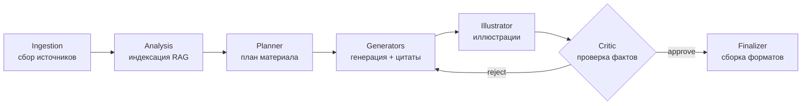

<h1 align="center">🏛 Education Content Agents</h1>

<p align="center">
  <b>Мультиагентная LLM-система, которая превращает проверенные источники<br>
  в структурированный образовательный контент: саммари, объяснения, учебные материалы и иллюстрации.</b>
</p>

<p align="center">
  
  
  
  
</p>

---

## 📖 О проекте

Система принимает на вход разрозненные проверенные источники (Markdown, текст, в перспективе
PDF и веб-страницы) и автоматически собирает из них учебный материал. Обработка построена как
**цепочка агентов**: сбор данных → анализ и индексация → планирование → генерация текста →
генерация иллюстраций → проверка фактов → финальная сборка.

Ключевой принцип — **data-driven и grounding**: каждое содержательное утверждение опирается на
конкретный фрагмент источника и сопровождается цитатой. За это отвечает агент-критик, который при
нехватке подтверждений возвращает материал на доработку (цикл самокоррекции).

Проект устроен по **гексагональной архитектуре** (порты и адаптеры), поэтому провайдеры
(LLM, эмбеддинги, генерация картинок) меняются одной настройкой, без правок в логике агентов.

> 💡 Каркас запускается **без интернета и без ключей** — на встроенных mock-провайдерах.
> Это позволяет сразу прогнать весь конвейер, изучить код и увидеть систему в работе,
> а настоящий **Yandex Cloud** подключается переменными окружения.

---

## ✨ Возможности

- 🔗 Конвейер из 7 агентов на **LangGraph** (граф состояния) с потоковой выдачей событий.
- 🔁 Цикл самокоррекции: критик проверяет grounding и возвращает на доработку.
- 🔍 Трассировка прогонов в **LangSmith** (опционально).
- 🧠 RAG: in-memory (офлайн) или **FAISS** (LangChain) — переключается переменной.
- 📚 Три типа контента: краткое саммари, подробное объяснение, учебные материалы.
- 🖼 Генерация иллюстраций к разделам.
- 📄 Три формата на выходе: Markdown, HTML-сайт, слайды (Marp).
- 👥 Профили аудитории (школьники / студенты / специалисты) — задаются при запуске.
- 🧩 Порты и адаптеры: mock ↔ Yandex переключаются конфигом.
- 🖥 Дэш на Streamlit с тёмной темой и живым мониторингом конвейера.

---

## 🗺 Архитектура



Агенты зависят только от **портов** (`ports.py`). Конкретные реализации подставляют
**фабрики** (`factories.py`) по переменным окружения — поэтому смена mock → Yandex
не требует изменений в агентах.

```
[ Дэш / CLI ] --RunConfig--> [ JobManager ] --запуск--> [ Конвейер агентов ]
      ▲                                                        │
      └──────────── PipelineEvent (поток событий) ◄────────────┘
```

---

## 📂 Структура

```
src/content_agents/
  models.py        # структуры данных (Document, Draft, Job, Workspace, ...)
  ports.py         # интерфейсы (контракты) провайдеров
  config.py        # RunConfig, профили аудитории, рабочие пространства (projects)
  factories.py     # выбор адаптера по переменным окружения
  prompts.py       # загрузчик промтов из файлов-шаблонов
  tracing.py       # интеграция с LangSmith (трассировка)
  utils.py         # утилиты (разбор JSON из ответа модели)
  job_manager.py   # сборка конвейера и запуск задания
  main.py          # запуск из командной строки
  agents/          # семь агентов (по файлу на агента)
  graph/           # state.py (состояние) + workflow.py (граф LangGraph)
  services/        # адаптеры: llm/ embedding/ image/ vectorstore/ loaders/ renderers/
config/audiences/  # профили аудитории (YAML)
config/prompts/ru/ # ТЕКСТЫ ПРОМТОВ (отдельно от кода)
projects/          # рабочие пространства задач (настраивается через PROJECTS_ROOT)
  demo/
    data/sources/  # входные источники задачи
    outputs/       # результаты задачи
dashboard/app.py   # Streamlit-дэш (тёмная тема, живой мониторинг)
.streamlit/        # тема дэша (config.toml)
tests/             # интеграционный тест
```

Каждая задача — отдельная подпапка в `projects/`. Чтобы завести новую задачу,
запустите с `--project имя` — каркас сам создаст `projects/имя/data/sources` и
`projects/имя/outputs`, останется положить туда источники. Корень `projects/`
настраивается флагом `--projects-root` или переменной `PROJECTS_ROOT` (можно
вынести за пределы репозитория).

---

## 🚀 Быстрый старт

Требуется Python 3.11+. Зависимости MVP минимальны: `pyyaml`, `requests`, `numpy`.

### Установка

```bash
# создаём и активируем окружение
python -m venv .venv
source .venv/bin/activate          # Windows PowerShell: .venv\Scripts\Activate.ps1

# ставим проект со всеми зависимостями (pyyaml, numpy, requests, langgraph, ...)
pip install -e .                    # или: uv pip install -e .
pip install -e ".[dashboard]"       # + дэш (Streamlit), по желанию
pip install -e ".[tracing]"         # + LangSmith-трассировка, по желанию
```

### Запуск из командной строки (офлайн, mock)

```bash
PYTHONPATH=src python -m content_agents.main \
    --project demo \
    --audience university \
    --outputs markdown html slides
```

> Windows PowerShell: задайте `$env:PYTHONPATH="src"` отдельной строкой, затем `python -m content_agents.main ...`.

Источники берутся из `projects/demo/data/sources`, результаты появятся в
`projects/demo/outputs` (`summary.md`, `summary.html`, `slides.md`, `images/*.png`).
Для новой задачи укажите другое имя: `--project моя-тема` — папки создадутся сами.

### Параметры запуска

| Флаг | Назначение |
|---|---|
| `--project` | имя задачи — подпапка в `projects/` (по умолчанию `demo`) |
| `--projects-root` | корень с задачами (по умолчанию `./projects` или `$PROJECTS_ROOT`) |
| `--audience` | id профиля из `config/audiences/` |
| `--outputs` | `markdown` / `html` / `slides` (можно несколько) |
| `--content-types` | `summary` / `explanation` / `edu_material` |
| `--volume` | `short` / `standard` / `detailed` |
| `--max-revisions` | лимит циклов доработки критика |
| `--strict-grounding` | выбрасывать неподтверждённые блоки |
| `--delay` | пауза между шагами, сек (для наглядности; авто 0.6 на mock) |
| `--sources` / `--out` | переопределить пути источников/результатов вручную |

---

## 🖥 Дэш (живой мониторинг)

```bash
pip install streamlit              # или: uv pip install streamlit
streamlit run dashboard/app.py     # запускать из корня проекта
```

Откроется на `http://localhost:8501`. Заполните форму, нажмите «Запустить конвейер» —
статусы агентов, журнал решений и метрики grounding обновляются в реальном времени.
Слайдер «Пауза между шагами» замедляет конвейер на mock, чтобы видеть цепочку агентов.

> Тёмная тема задаётся `.streamlit/config.toml` (цвета) и CSS в `dashboard/app.py` (шрифты,
> карточки). Тема из config применяется только при запуске **из корня проекта**.

---

## ⚙️ Профили аудитории

Профиль выбирается при запуске и влияет на промпты (глубину, стиль, пояснение терминов).
Поставляются преднастроенные профили в `config/audiences/`:

```yaml
# config/audiences/university.yaml
id: university
title: "Студенты вуза"
reading_level: "продвинутый, допускается терминология"
tone: "академический, со строгими формулировками"
prior_knowledge: "базовые понятия предметной области освоены"
glossary_policy: "пояснять только узкоспециальные термины"
```

Чтобы добавить свой профиль — создайте новый `*.yaml` и передайте его id в `--audience`.

---

## 🧠 Промты

Все тексты промтов вынесены из кода в `config/prompts/ru/` — по файлу на промт.
Их можно править без знания Python, а изменения видны в git как изменения текста.

| Файл | Где используется |
|---|---|
| `analysis.system` / `analysis.user` | выделение тем (агент Analysis) |
| `generators.system` | системная роль генератора (учитывает профиль аудитории) |
| `generators.summary` / `.explanation` / `.edu_material` | задачи генерации по типам контента |
| `illustrator.system` / `illustrator.user` | описание иллюстрации (агент Illustrator) |
| `planner.system` / `planner.user` | план материала в виде JSON (агент Planner) |
| `critic.system` / `critic.user` | проверка grounding в виде JSON (агент Critic) |

Шаблоны используют плейсхолдеры `{{имя}}`, которые подставляются загрузчиком
`prompts.py` (например, `{{context}}`, `{{audience_title}}`). Двойные скобки выбраны
намеренно — одиночные `{ }` (в примерах JSON) остаются нетронутыми.

Агенты **Planner** и **Critic** работают через LLM (модель возвращает JSON), но
устойчивы к сбоям: Planner при некорректном JSON откатывается к детерминированному
плану. Critic проверяет все черновики **одним батч-запросом** (а не по запросу на
каждый), черновики без цитат отсекает без вызова модели, а при неполном ответе
применяет мягкую деградацию, чтобы не зациклить доработку.

---

## 🔌 Подключение Yandex Cloud

Реальный режим использует YandexGPT (текст), эмбеддинги Yandex (RAG) и YandexART (картинки).
Подключение сделано по образцу [pueraeternis/yandex-gpt-api](https://github.com/pueraeternis/yandex-gpt-api).

1. Скопируйте `.env.example` → `.env`, заполните ключи.
2. Выставьте бэкенды и ключи в окружении:

```bash
export LLM_BACKEND=yandex
export EMBEDDING_BACKEND=yandex
export IMAGE_BACKEND=yandex
export YC_API_KEY=ваш_ключ
export YC_FOLDER_ID=ваш_folder_id
```

Код агентов при этом не меняется — фабрики подставят Yandex-адаптеры
(`services/llm/yandex_gpt.py`, `services/embedding/yandex_emb.py`, `services/image/yandex_art.py`).

---

## ✅ Тесты

```bash
PYTHONPATH=src python tests/test_pipeline.py
```

Прогоняет весь конвейер на mock и проверяет: статус задания, наличие всех форматов,
срабатывание цикла самокоррекции и метрики grounding.

---

## 🧠 RAG (поиск по источникам)

«Data-driven» обеспечивается слоем RAG за портом `VectorStore`:
- **Analysis** режет документы на чанки (через `langchain_text_splitters`, с офлайн-fallback)
  и кладёт их в индекс;
- **Generators** перед генерацией ищет релевантные фрагменты и подкладывает их в промт;
- хранилище само векторизует тексты — агенты работают с текстом, а не с векторами.

Два бэкенда, переключаются переменной `RAG_BACKEND`:

| `RAG_BACKEND` | Что это | Когда |
|---|---|---|
| `memory` (по умолчанию) | numpy + косинус, в памяти | офлайн, демо, маленькие объёмы |
| `faiss` | LangChain + FAISS (`faiss-cpu`) | масштаб, «как в проде» |

FAISS использует **те же** эмбеддинги (Yandex/mock) через обёртку `LangchainEmbeddings`.
Включение:

```bash
pip install -e ".[rag]"      # langchain, langchain-community, langchain-text-splitters, faiss-cpu
export RAG_BACKEND=faiss
```

## 🧱 Стек

Python 3.11 · **LangGraph** (оркестрация графа агентов) · **LangChain + FAISS** (RAG) ·
**LangSmith** (трассировка, опц.) · PyYAML · NumPy · Requests · Streamlit (дэш) ·
Yandex Cloud (YandexGPT / эмбеддинги / YandexART).

Конвейер собран как `StateGraph` LangGraph: узлы = агенты, состояние = `PipelineState`,
условное ребро после критика = петля самокоррекции (см. `graph/workflow.py`). Наружу
оркестратор отдаёт поток событий `PipelineEvent`, который потребляют дэш и CLI.

## 🔍 Трассировка (LangSmith)

Прогоны конвейера можно наблюдать в [LangSmith](https://smith.langchain.com): граф,
тайминги узлов и вложенные вызовы модели. Включается переменными окружения:

```bash
export LANGCHAIN_TRACING_V2=true
export LANGCHAIN_API_KEY=<ключ из smith.langchain.com>
export LANGCHAIN_PROJECT=education-content-agents   # необязательно
pip install -e ".[tracing]"
```

Без этих переменных трассировка просто выключена — на работу конвейера не влияет.

---

## 🛣 Дорожная карта

- [ ] Реальные загрузчики PDF (`pymupdf`) и URL (`trafilatura`) — сейчас заглушки.
- [ ] Сохранение/загрузка FAISS-индекса на диск (инкрементальное обновление).
- [ ] Чекпоинты LangGraph (пауза/возобновление, human-in-the-loop между узлами).
- [ ] Экспорт слайдов в `.pptx` (`python-pptx`), академический стиль цитат.
- [ ] История заданий и human-in-the-loop редактирование в дэше.
- [ ] Мультиязычная генерация из одних источников.

---

## 🙏 Благодарности

- Архитектурная основа (LangGraph-подход, порты и адаптеры, цепочка агентов) —
  [pueraeternis/autonomous-content-agents](https://github.com/pueraeternis/autonomous-content-agents).
- Паттерн интеграции с Yandex Cloud —
  [pueraeternis/yandex-gpt-api](https://github.com/pueraeternis/yandex-gpt-api).
- Оформление дэша вдохновлено эстетикой [History's Edge](https://historygame.ru/).

---

## 📄 Лицензия

MIT — добавьте файл `LICENSE` в корень репозитория перед публикацией.
